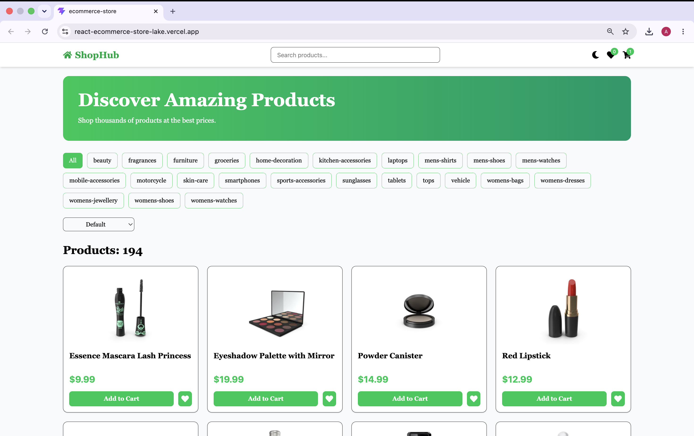
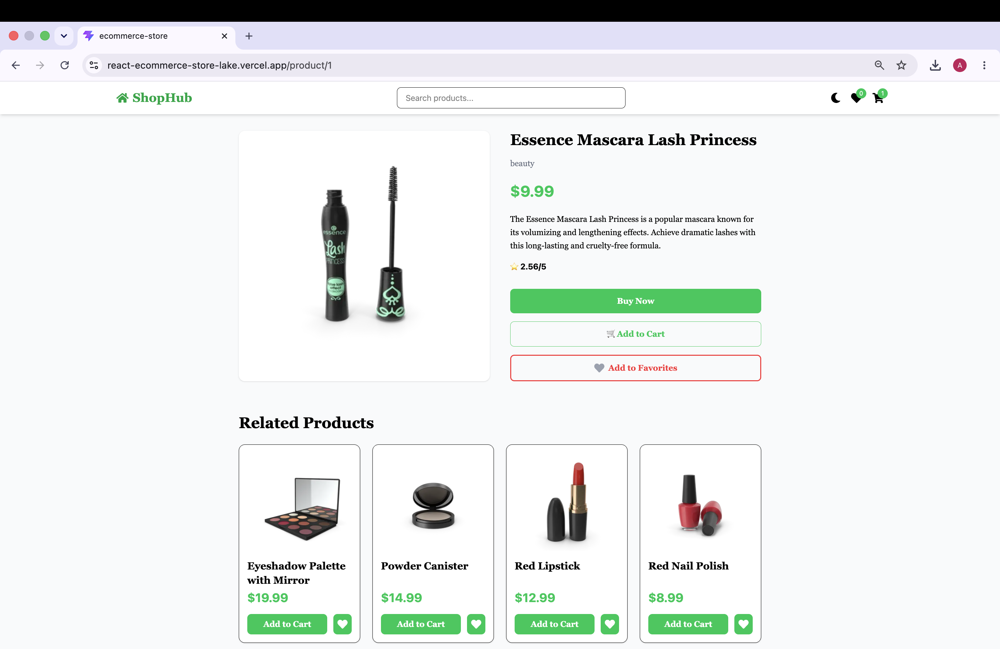
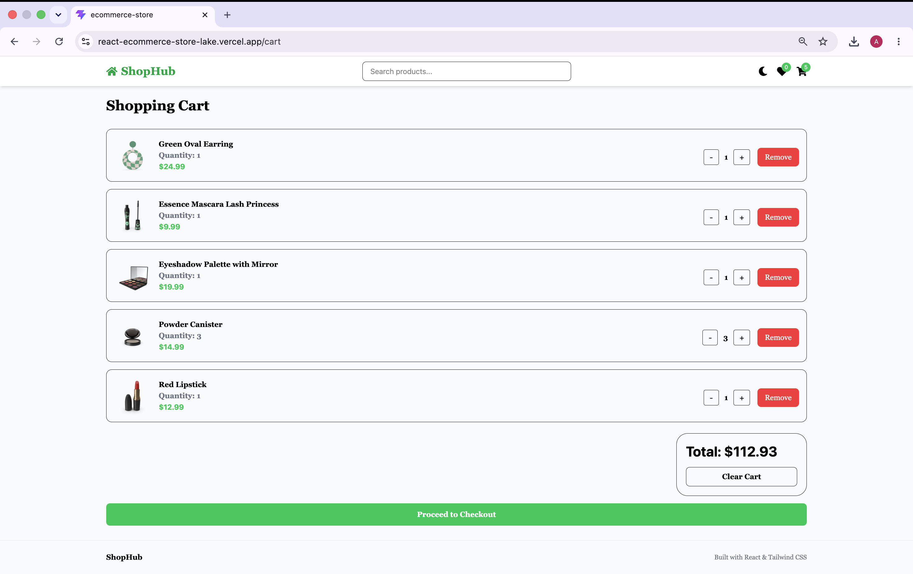
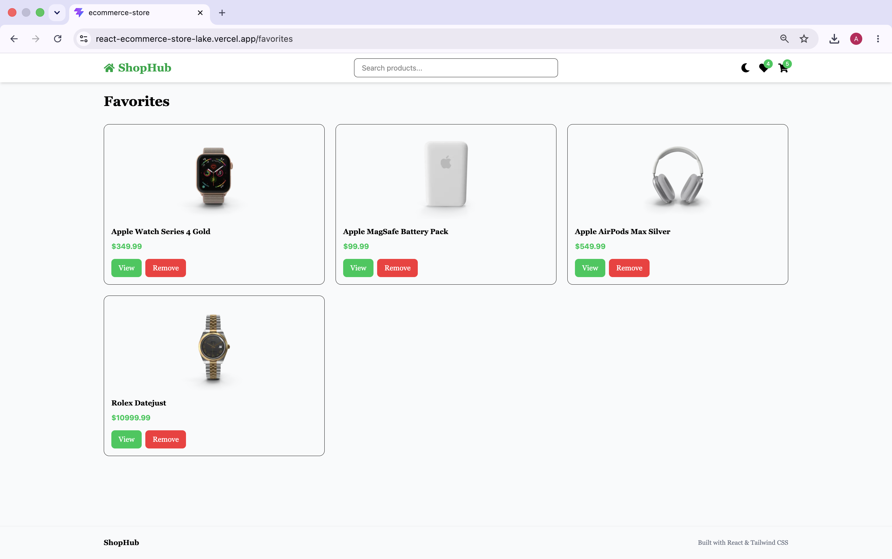
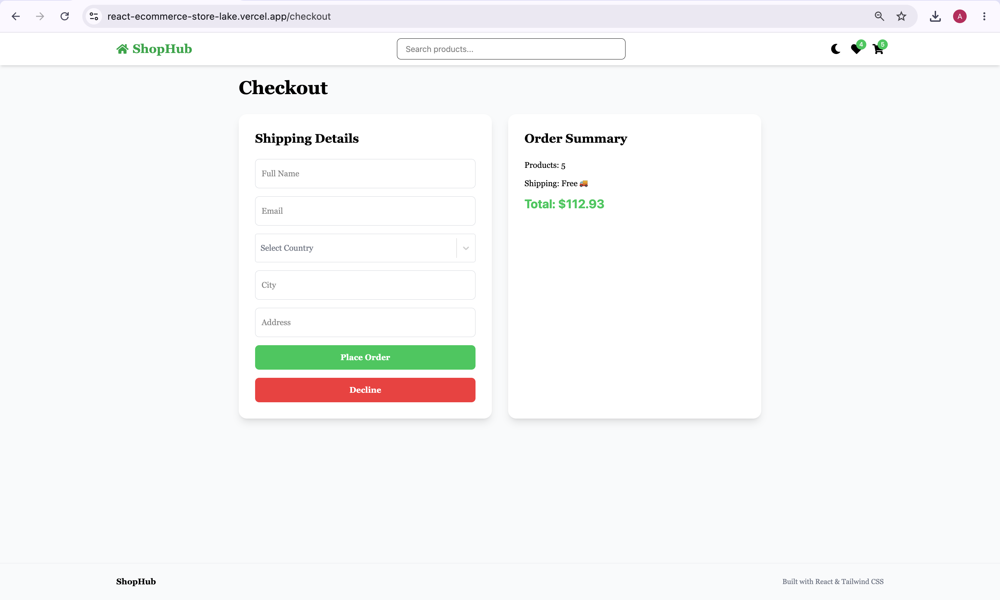
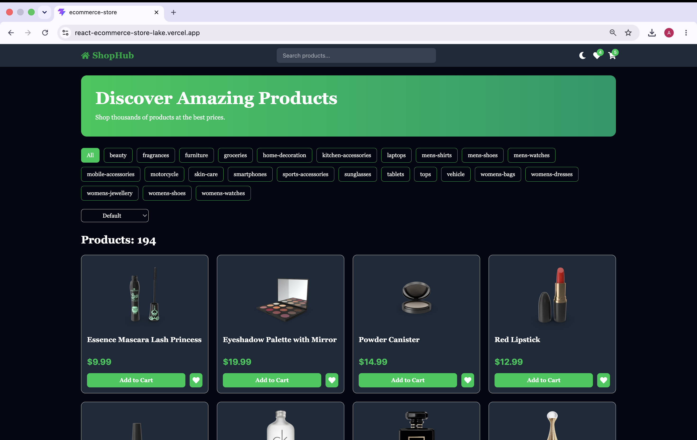

🛍️ ShopHub

A modern e-commerce web application built with React and Tailwind CSS.

🚀 Features

* Browse products from API
* Search products by name
* Filter products by category
* Sort products by price
* Product details page
* Product image gallery
* Related products section
* Shopping cart with quantity controls
* Favorites system
* Dark mode support
* Checkout page with country selection
* Order success page
* Responsive mobile design
* Local storage persistence
* 404 Not Found page

🛠️ Technologies Used

* React
* React Router DOM
* Context API
* Tailwind CSS
* React Toastify
* React Icons
* React Select
* Local Storage API
* DummyJSON API

📸 Main Functionality

Home Page

* Search products
* Category filtering
* Sorting
* Pagination

Product Details

* Multiple product images
* Add to cart
* Add to favorites
* Related products

Cart

* Increase/decrease quantity
* Remove items
* Clear cart
* Total price calculation

Checkout

* Shipping form
* Country selection
* Order summary

Order Success

* Confirmation page after purchase

💾 Data Persistence

Cart items, favorites, and dark mode preferences are stored using Local Storage.

📱 Responsive Design

The application is fully responsive and optimized for desktop and mobile devices.

## 📸 Screenshots

### Home Page

### Product Details

### Cart

### Favorites

### Checkout

### Dark Mode

▶️ Installation

git clone https://github.com/ga1ssaa/react-ecommerce-store.git
cd react-ecommerce-store
npm install
npm run dev

🌐 Live Demo

https://react-ecommerce-store-lake.vercel.app/

👨‍💻 Author

Developed by Aldiyar Gaisa

* GitHub: https://github.com/ga1ssaa
* LinkedIn: https://www.linkedin.com/in/aldiyar-gaisa-0b2a78414/